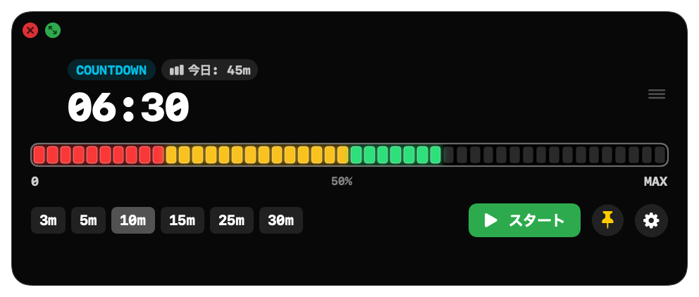
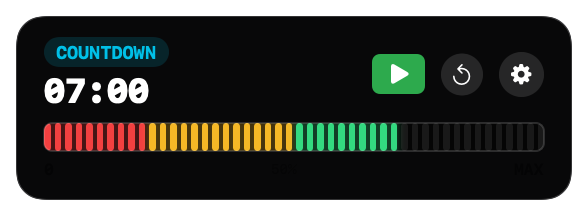
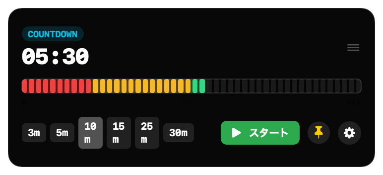
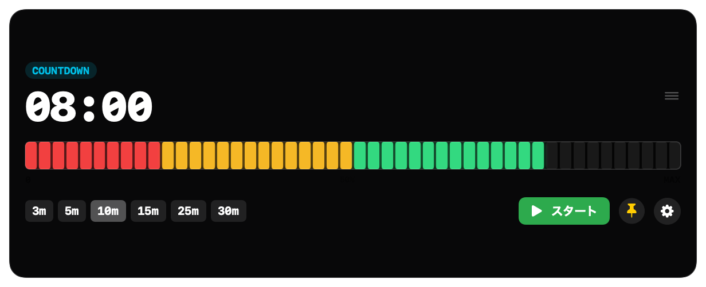
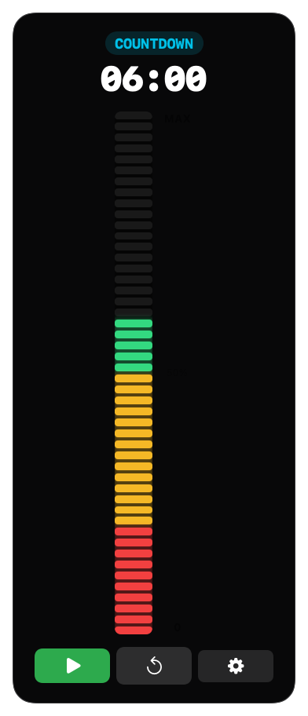
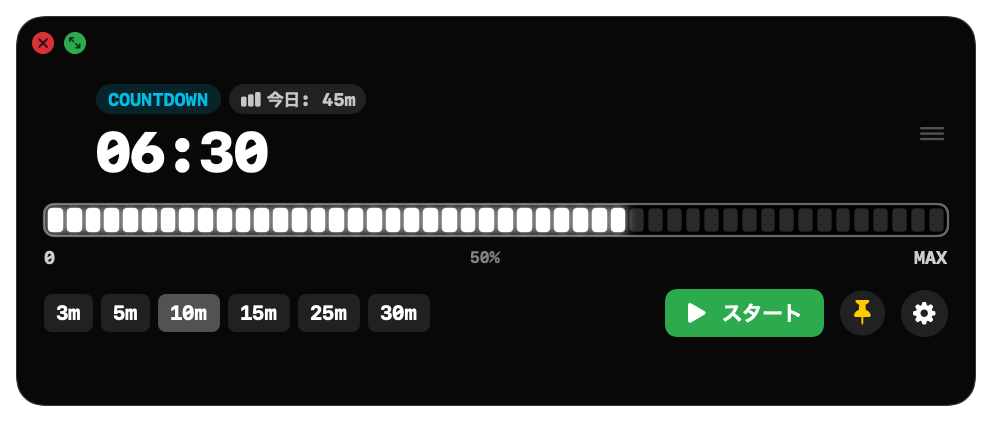
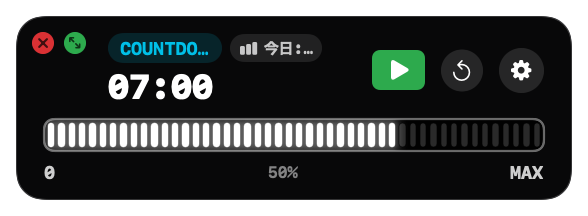
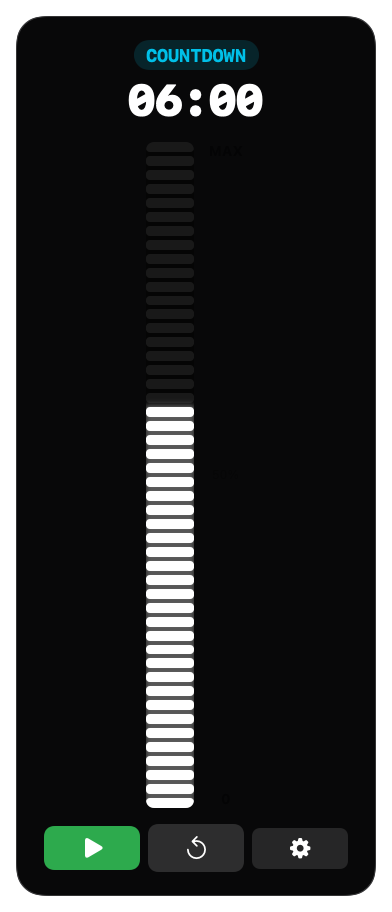

# VisualBarTimer ⏱️

<p align="center">
  <b>A sleek, minimalist visual LED bar timer and menu bar companion for macOS.</b><br>
  macOSネイティブの直感的なフローティングLEDバータイマー ＆ メニューバー常駐アプリ
</p>

<p align="center">
  
  
  
  <a href="https://github.com/nanonigit/VisualBarTimer/releases/latest"></a>
</p>

<p align="center">
  
</p>

---

[English](#english) | [日本語](#日本語) | [Screenshots / 画面プレビュー](#screenshots)

---

<a name="screenshots"></a>
## 📸 Screenshots / 画面プレビュー

### 🎨 Color Theme (カラーモード: 残り時間で 緑 → 黄 → 赤 に変化)

| Medium (中) | Mini / Extra Small (極小スリムバー) |
| :---: | :---: |
|  |  |

| Small (小) | Large (大) | Vertical (縦向き) |
| :---: | :---: | :---: |
|  |  |  |

---

### ⚪ Monochrome Theme (白黒モード: 高コントラスト・ミニマルLED)

| Medium (白黒・中) | Mini (白黒・極小) | Vertical (白黒・縦向き) |
| :---: | :---: | :---: |
|  |  |  |

---

<a name="english"></a>
## English

### ✨ Key Features

* **Visual LED Bar**:
  * **Horizontal Mode**: Time drains from right to left with precision tick marks.
  * **Vertical Mode**: Time drains from top to bottom.
* **Color & Monochrome Themes**:
  * **Color Theme**: Changes smoothly based on remaining time (Green > 50% → Yellow 20–50% → Red < 20%).
  * **Monochrome Theme**: High-contrast, clean minimalist LED style.
* **Floating & Clean Borderless Widget**:
  * Seamless borderless floating window with no OS titlebar bands.
  * Move freely around your screen by dragging anywhere on the widget body.
  * Quick-close (🔴) and instant 4-size cycle toggle (🟢 ⤢) right on the widget.
  * Pin button (📌) keeps the timer always on top of your workflow.
  * Automatically remembers window position and custom durations across restarts.
* **Menu Bar & Background Mode**:
  * **Customizable Menu Bar Item**: Choose between `m` format (`⏱️ 45m`), `分` format (`⏱️ 45分`), **numbers only (`45` / `1:12`)**, icon only, or hidden.
  * **Launch at Login**: Starts automatically when logging into macOS (via SMAppService).
  * **Start Hidden**: Launch quietly to the menu bar without cluttering your desktop.
  * **Dock Visibility Toggle**: Hide dock icon to run strictly as a background menu bar accessory.
* **4 Flexible Window Sizes**:
  * **Mini (極小)**: Slim, unobtrusive 68px bar perfect for desk corners.
  * **Small (小)**, **Medium (中)**, **Large (大)**.
* **Intuitive Time Controls**:
  * **Click / Drag on Bar**: Set time directly by clicking anywhere on the bar.
  * **Click Clock to Edit**: Tap the digital clock to type custom minutes with your keyboard.
  * **Quick Presets**: `3m`, `5m`, `10m`, `15m`, `25m`, `30m`, `60m`.
* **Daily Activity Tracking, Editing, Export & Calendar Sync**:
  * Tracks total timer duration and session counts per day in real-time.
  * **Direct Calendar Sync**: One-click sync of daily focus time to **Google Calendar & Apple Calendar** (via EventKit).
  * **Manual Duration Adjustments**: Easily fix total time if you forgot to pause the timer (`±15m`, etc.).
  * **Export to CSV / JSON** with one click.
  * Automatically saves logs to `~/Library/Application Support/VisualBarTimer/activity_logs.json` for seamless integration with Obsidian, Notion, Python scripts, Raycast, and Shortcuts.
* **Modes & Feedback**:
  * Supports **Countdown**, **Countup**, and **Pomodoro** (25m Focus / 5m Break).
  * Audible alarm, flash animation, and macOS system notification upon completion.

---

### 📦 Installation

#### Homebrew (Recommended)

```bash
brew install --cask nanonigit/visual-bar-timer/visual-bar-timer
```

#### Manual Download
Download the latest `VisualBarTimer.zip` from [GitHub Releases](https://github.com/nanonigit/VisualBarTimer/releases), unzip, and move `VisualBarTimer.app` to your `/Applications` folder.

---

### ⌨️ Shortcuts

* `Space`: Start / Pause
* `R`: Reset timer
* `Esc`: Close settings window

---

<a name="日本語"></a>
## 日本語

### ✨ 主な機能

* **視覚的LEDバー表示**:
  * **横向き**: 右から左へ目盛が減少（直感的な残り時間把握）
  * **縦向き**: 上から下へ目盛が減少
* **カラー & 白黒テーマ**:
  * **カラー**: 残り時間に応じて変化（緑 50%以上 → 黄 20〜50% → 赤 20%以下）
  * **白黒（モノトーン）**: 余計な色を排した高コントラストなLED表示
* **フローティング & ボーダーレスウィジェット**:
  * タイトルバーの帯を排除した美しい角丸フローティングデザイン
  * ウィジェット本体のどこを掴んでも画面上を自由にドラッグ移動可能
  * 左上に **赤い✕ボタン** と **ワンクリックサイズ切替トグル（🟢 ⤢）** を配置
  * 📌ピンボタンで常時最前面への固定/解除が可能
  * **位置と分数の自動記憶**: 最後に置いた位置や手入力した分数を再起動後も自動復元
* **メニューバー常駐 ＆ バックグラウンド動作**:
  * **メニューバー表示カスタマイズ**: `m` 表示（`⏱️ 45m`）、`分` 表示（`⏱️ 45分`）、**数字のみ（`45` / `1:12`）**、アイコンのみ、非表示から選択可能
  * **Macログイン時自動起動**: macOS標準のログイン項目として自動起動（SMAppService対応）
  * **起動時にウィンドウを隠す**: 起動時に画面を邪魔せず、メニューバー常駐として静かに起動
  * **Dock表示切替**: Dockアイコンを非表示にして完全なメニューバーアクセサリとして使用可能
* **4段階のサイズプリセット**:
  * **極小 (Mini)**: デスクトップの隅に邪魔にならず置けるスリムバー（高さ約68px）
  * **小 (Small)**, **中 (Medium)**, **大 (Large)**
* **直感的な時間設定**:
  * **バーを直接クリック/ドラッグ**: バー上の位置をクリックして直感的に時間をセット
  * **分数の直接手入力**: デジタル時計部分（`10:00`など）をクリックしてキーボードで好きな分数を即入力
  * **ワンクリックプリセット**: `3m`, `5m`, `10m`, `15m`, `25m`, `30m`, `60m`
* **日別稼働ログ・手動修正・Google/Macカレンダー連携**:
  * 一日あたりの総タイマー稼働時間とセッション回数を自動でリアルタイム集計。
  * **カレンダー直接同期**: 今日の総稼働時間（セッション内訳・分数）を **Googleカレンダー / Appleカレンダーにワンクリックで予定として書き込み**。
  * **手動時間修正**: 止め忘れ時に分数を手動入力または `±15分` などのボタンで簡単に微調整可能。
  * **CSV / JSON 形式でのワンクリック書き出し**・クリップボードコピーに対応。
  * ログは `~/Library/Application Support/VisualBarTimer/activity_logs.json` に標準JSONで自動保存されるため、Obsidian、Notion、Pythonスクリプト、Raycast、ショートカット等と容易に連携可能。
* **多彩なモード & 通知**:
  * **カウントダウン** / **カウントアップ** / **ポモドーロ**（25分作業 / 5分休憩）
  * タイムアップ時にアラーム音 ＋ バーの点滅フラッシュ ＋ macOSシステム通知

---

### 📦 インストール方法

#### Homebrew (推奨)

```bash
brew install --cask nanonigit/visual-bar-timer/visual-bar-timer
```

#### 手動ダウンロード
[GitHub Releases](https://github.com/nanonigit/VisualBarTimer/releases) から最新の `VisualBarTimer.zip` をダウンロード・展開し、`VisualBarTimer.app` を `/Applications`（アプリケーション）フォルダに移動してください。

---

### ⌨️ ショートカットキー

* `Space`: スタート / 一時停止
* `R`: リセット
* `Esc`: 設定ウィンドウを閉じる

---

## 🛠️ Build from Source

```bash
git clone https://github.com/nanonigit/VisualBarTimer.git
cd VisualBarTimer
swift run
```
